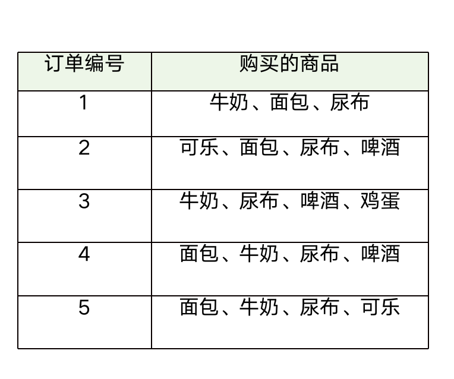

# 关联规则中的支持度、置信度和提升度代表的什么，如何计算？
   - 支持度为集合在总项集中出现的概率.
   - 置信度表示在先决条件X发生的情况下，由关联规则X-Y推出Y的概率。
   - 提升度：提升度表示含有X的条件下，同时含有Y的概率；并且与Y总体发生的概率做比值。（如果提升度>1,则关联规则是一个强关联规则；如果提升度小于等于1，则为无效的关联规则，如果提升度=1，则X与Y相互独立）
   例如某超市的订单如下
    
    牛奶的支持度为 ：牛奶出现的次数 / 总订单数 = 4 / 5 = 0.8
    (牛奶->面包)的置信度 ： 牛奶和面包同时出现的次数 / 牛奶出现的次数 = 3 / 4 = 0.75
    (牛奶->面包)的提升度 ： (牛奶->面包)的置信度 / 面包的支持度 = 0.75 / 0.8 = 0.9375
   
# 关联规则与协同过滤的区别?
    关联规则通常是通过对大量订单的分析寻找商品和商品之间的内在联系，最终达到优化商品和商品之间的搭配。而协同过滤主要是通过对大量用户数据的建模，找到该用户的相似群体从而对改用户的行为，喜好进行预测和推荐。

# 为什么我们需要多种推荐算法？
    - 现实环境的复杂性决定了单一的推荐算法是不能解决所有问题的。
    - 我们在实际问题中有时候面向用户的推荐目的不一样，也需要不一样的算法来解决问题。
    
# 关联规则中的最小支持度、最小置信度该如何确定
    - 最小支持度、最小置信度，应该都是属于超参数的范畴，需要根据实验不断的调整，大体来说最小值支持度差别较大。可能是0.01到0.5之间，最小置信度：可能是0.5到1之间。
    - 选择条件主要是根据实际数据集的大小。数据集小的话最小支持度值偏大，数据集中数据关联度强最小置信度 偏大
    - 也可以根据实际的需求来调整这两个参数，比如实际需求只要求输出前20项，我们就可以先设置一个偏小的值，输出数据观察后再慢慢提高数值，是数据输出符合预期。

# 都有哪些常见的回归分析方法，评价指标是什么？
    - 按照涉及的变量的多少，分为一元分析和多元回归分析 
    - 按照因变量（数据集的特征数）的多少，分为简单回归分析和多重回归分析
    - 按照自变量和因变量之间的关系类型，分为线性回归分析和非线性回归分析
###    评价指标 
    - MSE(均方误差) 等于 和方差 / 样本总数
    - 确定系数(确定系数) 等于1减去y对回归方程的方差（未解释离差）与y的总方差的比值
    
### 针对MarketBasket数据集进行购物篮分析（频繁项集及关联规则挖掘）
    代码详见 [makeBasket.ipynb文件]('./makeBasket.ipynb')